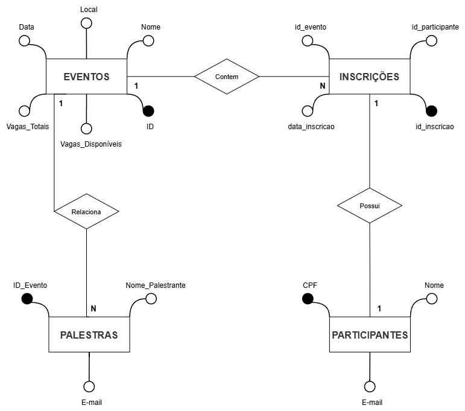

# README - Sistema de Gerenciamento de Eventos

---

## 📚 Sumário

- [Descrição Geral](#descrição-geral)  
- [Diagrama do Banco de Dados](#diagrama-do-banco-de-dados)  
- [Estrutura do Banco de Dados](#estrutura-do-banco-de-dados)  
- [População Inicial de Dados](#população-inicial-de-dados)  
- [Funcionalidades CRUD](#funcionalidades-crud)  
- [Otimizações Implementadas](#otimizações-implementadas)  
- [Triggers e Integridade](#triggers-e-integridade)  
- [Stored Procedure e Controle ACID](#stored-procedure-e-controle-acid)  
- [Views para Relatórios](#views-para-relatórios)  
- [Consultas Exemplares](#consultas-exemplares)  
- [Como Utilizar](#como-utilizar)  
---

## Descrição Geral

Este projeto consiste em um sistema robusto para gerenciamento de eventos, contemplando o cadastro de eventos, participantes, palestras e inscrições. O banco de dados foi projetado para garantir integridade, eficiência e facilidade de consulta, utilizando recursos avançados do MySQL como constraints, triggers, stored procedures e views.

O sistema é ideal para organizações que desejam controlar eventos com múltiplas palestras, gerenciar inscrições e acompanhar a ocupação das vagas em tempo real.

---

## Diagrama do Banco de Dados

  
   

---

## Estrutura do Banco de Dados

### Tabela `Eventos`

- **id_evento**: Identificador único do evento (auto-incremento).  
- **nome**: Nome do evento.  
- **local**: Local onde o evento será realizado.  
- **data_evento**: Data do evento.  
- **vagas_totais**: Total de vagas disponíveis.  
- **vagas_disponiveis**: Vagas restantes para inscrição (não pode ser negativo).  

### Tabela `Participantes`

- **id_participante**: Identificador único do participante (auto-incremento).  
- **nome**: Nome completo do participante.  
- **email**: Email único do participante.  

### Tabela `Palestras`

- **id_palestra**: Identificador único da palestra (auto-incremento).  
- **id_evento**: Chave estrangeira para o evento ao qual a palestra pertence.  
- **nome_palestrante**: Nome do palestrante.  
- **duracao_minutos**: Duração da palestra em minutos.  

### Tabela `Inscricoes`

- **id_inscricao**: Identificador único da inscrição (auto-incremento).  
- **id_participante**: Chave estrangeira para o participante inscrito.  
- **id_evento**: Chave estrangeira para o evento inscrito.  
- **data_inscricao**: Timestamp da inscrição (default: momento da inserção).  
- **Restrição**: Um participante não pode se inscrever duas vezes no mesmo evento (chave única composta).  

---

## População Inicial de Dados

O banco já contém uma base inicial com:

- 50 eventos variados, com diferentes locais, datas e capacidades.  
- 100 participantes fictícios com nomes e emails únicos.  
- 100 palestras distribuídas entre os eventos, com palestrantes e durações variadas.  
- 150 inscrições simulando a participação dos usuários nos eventos.  

---

## Funcionalidades CRUD

- **UPDATE**: Exemplo de atualização do local de um evento.  
- **DELETE**: Exemplo de remoção de uma palestra específica.  
- **INSERT**: Inserção de dados inicial e via stored procedure para inscrições.  

---

## Otimizações Implementadas

- Índices criados para acelerar consultas por email (`Participantes.email`) e data do evento (`Eventos.data_evento`).  
- Constraints para garantir integridade dos dados, como a restrição de vagas não negativas e inscrição única.  

---

## Triggers e Integridade

- Trigger para restaurar automaticamente a vaga disponível no evento quando uma inscrição é deletada, garantindo consistência do número de vagas.  

---

## Stored Procedure e Controle ACID

- Procedure `InscreverParticipante` que gerencia a inscrição de um participante em um evento:  
  - Verifica disponibilidade de vagas com bloqueio para evitar condições de corrida.  
  - Insere a inscrição e atualiza o número de vagas disponíveis.  
  - Implementa tratamento de erros e rollback para garantir atomicidade e consistência.  

---

## Views para Relatórios

- View `View_Eventos_Alta_Lotacao` que lista eventos com mais de 100 inscritos, facilitando a análise de eventos populares.  

---

## Consultas Exemplares

1. **Filtrar participantes de eventos específicos com condições complexas**  
2. **Listar os primeiros 50 inscritos em ordem alfabética**  
3. **Listar palestras com seus respectivos eventos**  
4. **Combinar palestrantes e participantes em uma lista unificada**  
5. **Contar palestrantes por evento, filtrando eventos com mais de 3 palestras**  
6. **Identificar o evento com a palestra de maior duração**  
7. **Listar eventos do próximo fim de semana**  

---

## Como Utilizar

1. **Importar o script SQL**: Execute o script completo no seu servidor MySQL para criar o banco, tabelas, inserir dados e criar procedimentos, triggers e views.  
2. **Visualizar o diagrama**: Utilize a imagem do diagrama ER para entender as relações e estrutura do banco.  
3. **Executar consultas**: Utilize as consultas exemplares para extrair informações relevantes.  
4. **Gerenciar inscrições**: Use a stored procedure para garantir inscrições consistentes e seguras.  

---
